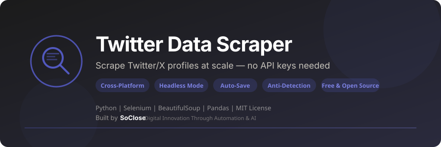

<p align="center">
  
</p>

<p align="center">
  <strong>Scrape Twitter/X profiles at scale — no API keys needed. Collect profile links and usernames from any page.</strong>
</p>

<p align="center">
  <a href="LICENSE"></a>
  <a href="https://www.python.org/downloads/"></a>
  
  <a href="https://www.selenium.dev/"></a>
  <a href="https://github.com/SoCloseSociety/TwitterDataScraper/stargazers"></a>
  <a href="https://github.com/SoCloseSociety/TwitterDataScraper/issues"></a>
  <a href="https://github.com/SoCloseSociety/TwitterDataScraper/network/members"></a>
</p>

<p align="center">
  <a href="#quick-start">Quick Start</a> &bull;
  <a href="#key-features">Features</a> &bull;
  <a href="#configuration">Configuration</a> &bull;
  <a href="#faq">FAQ</a> &bull;
  <a href="#contributing">Contributing</a>
</p>

---

## What is Twitter Data Scraper?

**Twitter Data Scraper** is a free, open-source **Twitter/X profile extraction tool** built with Python and Selenium. It collects profile links and usernames from any Twitter/X page — followers, search results, lists, and more — and exports them to clean CSV files.

Most Twitter scraper tools either require expensive API access, break frequently, or are bloated with unnecessary dependencies. This scraper takes a different approach: zero API cost, lightweight (4 dependencies), and built for reliability with auto-save and graceful shutdown.

### Who is this for?

- **Growth Hackers** building follower lists for outreach campaigns
- **Digital Marketers** analyzing competitor audiences on Twitter/X
- **Data Analysts** collecting social media profile datasets
- **Researchers** studying Twitter/X user networks and engagement
- **Sales Teams** building prospect lists from industry conversations
- **Developers** learning Selenium browser automation

### Key Features

- **Zero API Cost** - Scrapes directly from the Twitter/X web interface
- **Headless Mode** - Runs invisibly in the background for servers and CI/CD
- **Smart Deduplication** - O(1) set-based lookups ensure zero duplicate profiles
- **Auto-Save** - Periodically saves progress to CSV so you never lose data
- **Graceful Shutdown** - Press Ctrl+C anytime; data is saved before exit
- **Human-Like Behavior** - Randomized scroll pauses (1.5s–3.0s) to mimic natural browsing
- **Anti-Detection** - Stealth browser fingerprint to reduce automation detection
- **Configurable** - Adjust timeouts, scroll speed, and output file via CLI flags
- **Clean Output** - Full Twitter profile URLs and @handles exported to CSV
- **Free & Open Source** - MIT license, no API key required

---

## Quick Start

### Prerequisites

| Requirement | Details |
|-------------|---------|
| **Python** | Version 3.9 or higher ([Download](https://www.python.org/downloads/)) |
| **Google Chrome** | Latest version ([Download](https://www.google.com/chrome/)) |
| **Twitter/X Account** | Required for accessing follower lists and search results |

### Installation

```bash
# 1. Clone the repository
git clone https://github.com/SoCloseSociety/TwitterDataScraper.git
cd TwitterDataScraper

# 2. (Recommended) Create a virtual environment
python -m venv venv

# Activate it:
# Windows:
venv\Scripts\activate
# macOS / Linux:
source venv/bin/activate

# 3. Install dependencies
pip install -r requirements.txt
```

### Usage

#### Visible mode (for manual login)

```bash
python main.py --visible -o my_profiles.csv
```

1. A Chrome window opens at the Twitter login page
2. Log in to your Twitter/X account manually
3. Navigate to the page you want to scrape (followers, search results, lists...)
4. Press **ENTER** in the terminal to start scraping
5. Press **Ctrl+C** to stop — your data is automatically saved

#### Headless mode (default)

```bash
python main.py -o my_profiles.csv
```

> **Note:** Headless mode requires pre-authenticated session cookies or a publicly accessible page.

#### All CLI Options

```bash
python main.py --help
```

| Option | Description | Default |
|--------|-------------|---------|
| `-o, --output FILE` | Output CSV filename | `scraped_profiles.csv` |
| `--visible` | Run browser in visible mode (required for manual login) | Off |
| `-m, --max-iterations N` | Maximum scroll iterations | Unlimited |
| `-v, --verbose` | Enable verbose debug logging | Off |

#### Examples

```bash
# Scrape profiles with visible browser
python main.py --visible -o tech_influencers.csv

# Limit to 100 scroll iterations
python main.py --visible -m 100 -o results.csv

# Debug mode
python main.py --visible -v -o debug_output.csv
```

---

## How It Works

```
┌──────────────────┐    ┌──────────────────┐    ┌──────────────────┐
│  Open Chrome     │───>│  Login manually  │───>│  Navigate to     │
│  via Selenium    │    │  (visible mode)  │    │  target page     │
└──────────────────┘    └──────────────────┘    └──────────────────┘
                                                        │
                                                        ▼
┌──────────────────┐    ┌──────────────────┐    ┌──────────────────┐
│  Export to CSV   │<───│  Deduplicate     │<───│  Scroll & extract│
│  (auto-save)     │    │  with set()      │    │  profile links   │
└──────────────────┘    └──────────────────┘    └──────────────────┘
```

---

## Output Format

Clean CSV output with full URLs — ready for analysis, CRM import, or further processing:

| Column | Description | Example |
|--------|-------------|---------|
| `profile_link` | Full URL to the Twitter profile | `https://twitter.com/elonmusk` |
| `profile_username` | Twitter handle with @ prefix | `@elonmusk` |

See [examples/sample_output.csv](examples/sample_output.csv) for a complete sample.

---

## Configuration

Tune the scraper in [`twitter_scraper/config.py`](twitter_scraper/config.py):

| Setting | Default | Description |
|---------|---------|-------------|
| `SCROLL_PIXELS` | `800` | Pixels to scroll per iteration |
| `SCROLL_PAUSE_MIN` | `1.5s` | Minimum pause between scrolls |
| `SCROLL_PAUSE_MAX` | `3.0s` | Maximum pause between scrolls |
| `MAX_STALE_ITERATIONS` | `60` | Iterations without new data before auto-stop |
| `CSV_BATCH_INTERVAL` | `10` | Save to CSV every N iterations |
| `PAGE_LOAD_TIMEOUT` | `30s` | Page load timeout |

---

## Project Structure

```
TwitterDataScraper/
├── twitter_scraper/        # Core package
│   ├── __init__.py         # Package exports (v1.0.0)
│   ├── browser.py          # Chrome WebDriver lifecycle management
│   ├── config.py           # Centralized configuration constants
│   ├── scraper.py          # Profile extraction engine
│   └── utils.py            # Connectivity check, logging, helpers
├── examples/               # Sample output files
├── .github/                # Issue & PR templates
├── main.py                 # CLI entry point
├── requirements.txt        # Python dependencies
├── pyproject.toml          # Package metadata & build config
├── assets/
│   └── banner.svg          # Project banner
├── LICENSE                 # MIT License
├── README.md               # This file
├── CONTRIBUTING.md         # Contribution guidelines
├── CODE_OF_CONDUCT.md      # Community standards
└── .gitignore              # Git ignore rules
```

---

## Troubleshooting

### Chrome driver issues

The scraper uses `webdriver-manager` to automatically download the correct ChromeDriver. If you encounter issues:

```bash
pip install --upgrade webdriver-manager
```

### No profiles found

If the scraper scrolls but doesn't find profiles:
1. Make sure you navigated to a page with profile links (followers, search results, lists)
2. Try using `--visible` mode to see what's happening
3. Twitter/X may have changed its HTML structure — open an issue

### Login issues

If you can't log in:
1. Use `--visible` mode for manual login
2. Complete any security challenges (CAPTCHA, 2FA) manually
3. Press ENTER only after fully logged in

### Permission denied errors (macOS/Linux)

```bash
chmod +x main.py
```

---

## FAQ

**Q: Is this free?**
A: Yes. Twitter Data Scraper is 100% free and open source under the MIT license.

**Q: Do I need a Twitter API key?**
A: No. This tool uses browser automation (Selenium), so no API key or developer account is needed.

**Q: How many profiles can I scrape?**
A: No hard limit. The scraper runs until no new profiles are found for 60 consecutive stale iterations. Use `-m` to set a maximum.

**Q: Can I scrape followers of a specific account?**
A: Yes. Navigate to the followers page of any account, press ENTER, and the scraper will collect all visible profiles.

**Q: Does it work on Mac / Linux?**
A: Yes. Fully cross-platform on Windows, macOS, and Linux.

**Q: Can I run it without a browser window?**
A: Yes. Headless mode is the default. Use `--visible` only when you need to log in manually.

---

## Alternatives Comparison

| Feature | Twitter Data Scraper | Twitter API v2 | Manual Copy-Paste | Paid Tools |
|---------|---------------------|----------------|-------------------|-----------|
| Price | **Free** | Free (limited) | Free | $50-200/mo |
| API key required | No | Yes | No | Yes |
| Rate limits | Browser-based | 500K tweets/mo | N/A | Varies |
| Profile extraction | Yes | Yes | Manual | Yes |
| Auto-save | Yes | N/A | N/A | Varies |
| Open source | Yes | N/A | N/A | No |
| Cross-platform | Yes | Any | Yes | Web only |

---

## Contributing

Contributions are welcome! Please read the [Contributing Guide](CONTRIBUTING.md) before submitting a pull request.

- Found a bug? [Open an issue](https://github.com/SoCloseSociety/TwitterDataScraper/issues/new?template=bug_report.md)
- Have an idea? [Request a feature](https://github.com/SoCloseSociety/TwitterDataScraper/issues/new?template=feature_request.md)

---

## License

This project is licensed under the [MIT License](LICENSE).

---

## Disclaimer

This tool is provided for **educational and research purposes only**. Users are responsible for ensuring their use complies with Twitter/X's [Terms of Service](https://twitter.com/en/tos) and all applicable laws. The authors are not responsible for any misuse of this software. Always scrape responsibly and respect rate limits.

---

<p align="center">
  <strong>If this project helps you, please give it a star!</strong><br>
  It helps others discover this tool.<br><br>
  <a href="https://github.com/SoCloseSociety/TwitterDataScraper">
    
  </a>
</p>

<br>

<p align="center">
  <sub>Built with purpose by <a href="https://soclose.co"><strong>SoClose</strong></a> &mdash; Digital Innovation Through Automation & AI</sub><br>
  <sub>
    <a href="https://soclose.co">Website</a> &bull;
    <a href="https://linkedin.com/company/soclose-agency">LinkedIn</a> &bull;
    <a href="https://twitter.com/SoCloseAgency">Twitter</a> &bull;
    <a href="mailto:hello@soclose.co">Contact</a>
  </sub>
</p>
